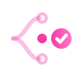
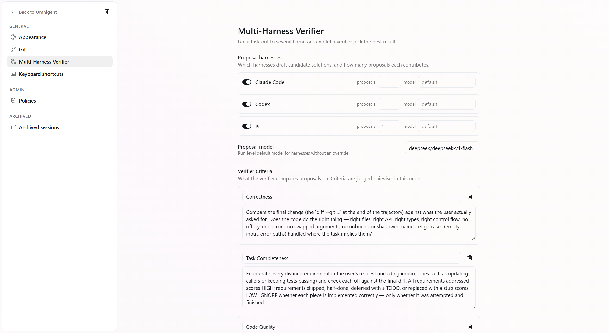
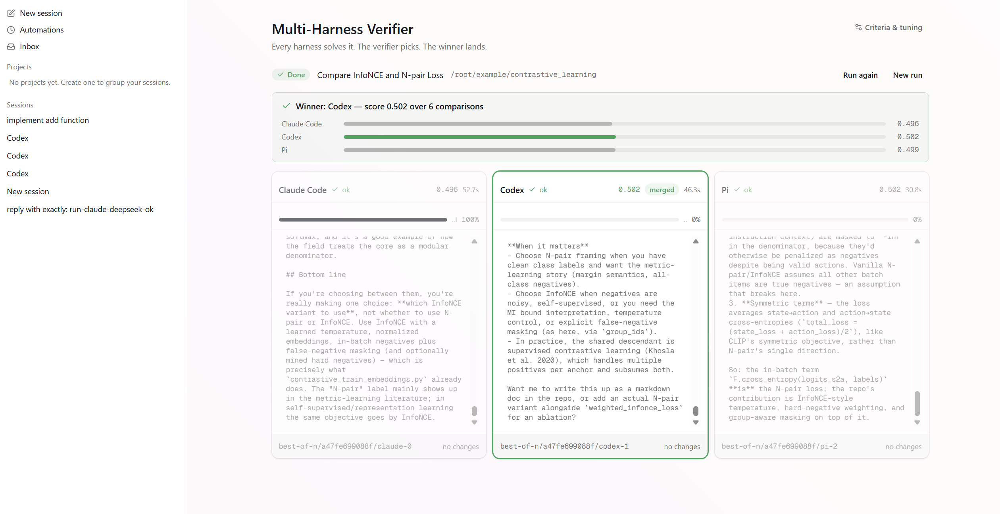
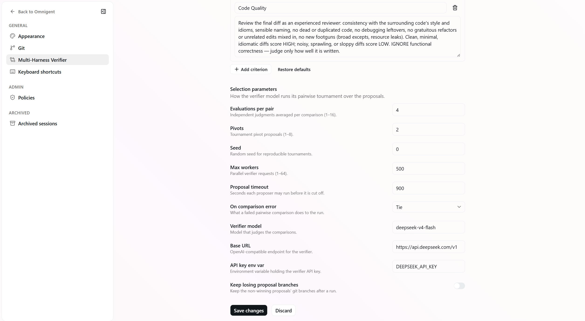

<div align="center">

#  Omnigent-Verified

### Multi-Harness, Auto-verified.

**codify** fans every coding task out to multiple coding agents — Claude Code, Codex, and Pi by
default — as parallel proposals in isolated git worktrees, ranks the resulting trajectories with an
LLM verifier, and squash-merges the winner. **The final commit on your branch is the selected
best-of-N proposal**, with its scores recorded in the commit message.

[](LICENSE)


</div>

---

## Why best-of-N?

A single agent's first answer is a coin flip: sometimes brilliant, sometimes subtly wrong, and the
agent's own "done, tests pass!" is not evidence. codify changes the unit of work from *one
attempt* to *one selection*:

1. **Fan out.** Each enabled proposer harness runs the same task headlessly in its **own git
   worktree + branch** off your current commit. Different harnesses (different models, different
   scaffolding) produce meaningfully more diverse proposals than resampling one agent.
2. **Snapshot.** Every proposal is committed on its branch; its candidate trajectory is
   `task + agent transcript + final git diff`.
3. **Verify.** [`llm_verifier.select`](llm_verifier/) — the in-tree LLM-as-a-Verifier library —
   ranks the candidates with a Probabilistic Pivot Tournament: directed pairwise comparisons scored
   by a fine-grained, logprob-based reward against explicit criteria (correctness, completeness,
   empirical verification, code quality). Cost is O(N·k), not O(N²).
4. **Merge.** The winning branch is squash-merged onto your branch; losing worktrees and branches
   are cleaned up.

The verifier is told to trust *what commands actually printed* over what the agent claimed —
untested claims and empty diffs lose tournaments.

## Quick start

```bash
git clone https://github.com/jackyk02/codify.git && cd codify
uv sync --extra dev                      # or: pip install -e .

export DEEPSEEK_API_KEY=sk-...           # proposals + verifier default to deepseek-v4-flash
```

Run it against any git repo:

```bash
cd /path/to/your/repo
codify best-of-n "fix the race in worker.py and add a regression test"
```

```text
run bf41ae4a: 3 proposal(s) from claude, codex, pi
  claude-0: ok, 1636 diff chars, 28s
  codex-1:  ok, 1532 diff chars, 37s
  pi-2:     ok, 1695 diff chars, 10s
scoring 3 candidate(s) with deepseek-v4-flash
winner: codex-1 (score 0.507, 6 comparisons)
merged as 231ac3447dd1
```

Or run it as a session — `codify run` auto-starts the local server and launches the
**Best-of-N** agent (the default mode, tagged *multi-agent auto-verify* in the web UI's session
picker). Give it a coding task and it dispatches the same task to Claude Code, Codex, and Pi as
**real child sessions** — open any of them in the UI's Subagents panel to watch that harness work
live (or take over), then switch between the three. When all proposals land, the verifier ranks
them and only the winner is merged:

```bash
codify run                          # session-native Best-of-N in the current repo
codify server                       # API + web UI on http://localhost:6767
```

Starting a new session with the Best-of-N agent opens the run view directly — the three
harnesses side by side as live panes — each with an **online
verifier progress bar**: `llm_verifier.ProgressTracker` scores every harness's streaming
transcript prefix as it works (the verifier structurally cannot see the future), so you watch a
calibrated skeptical estimate of "would this attempt pass the grader right now?" rise per pane
before selection even starts.

Requirements: a clean git tree (uncommitted work is never mixed into proposals), the proposer CLIs
you enable (`claude`, `codex`, `pi`) installed and authenticated, and an API key for the verifier
model.

## Configuration

Everything about a run is configuration — edit it in the web UI under **Settings → Best-of-N
Verifier**, over REST (`GET/PUT /v1/best-of-n/config`), or as the `best_of_n:` block in
`~/.codify/config.yaml` (a project-local `.codify/config.yaml` overrides it per-repo):

```yaml
best_of_n:
  proposers:                      # which harnesses construct proposal candidates
    - harness: claude
    - harness: codex
    - harness: pi
      count: 2                    # proposals per harness (1-8)
  proposal_model: deepseek/deepseek-v4-flash   # applies to gateway-capable harnesses (pi);
                                               # vendor-locked CLIs run their native model
  criteria:                       # name -> instruction; fully editable
    Correctness: >
      Compare the final change against what the user actually asked for...
    Empirical Verification: >
      Look at the commands the agent actually ran and what they printed...
  verifier:
    model: deepseek-v4-flash      # any OpenAI-compatible backend with token logprobs
    base_url: https://api.deepseek.com/v1
    api_key_env: DEEPSEEK_API_KEY
    n_evaluations: 4              # repeats per criterion per comparison
    pivots: 2                     # tournament pivots k (cost O(N·k))
    seed: 0                       # same inputs + seed -> identical tournament
    max_workers: 16
    on_error: tie                 # or "raise"
  keep_proposal_branches: false   # keep losers for inspection
```

Any headless CLI can join the roster via a `command` template — for example, running Codex without
its sandbox inside a container that lacks user namespaces:

```yaml
  proposers:
    - harness: codex
      command: ["codex", "exec", "--dangerously-bypass-approvals-and-sandbox",
                "--skip-git-repo-check", "{prompt}"]
```

**Verifier backends.** Any OpenAI-compatible endpoint that returns token-level logprobs works
(vLLM, SGLang, OpenAI, DeepSeek). For DeepSeek's official API, codify transparently rewrites
the verifier's score-reading prefill calls to the beta chat-prefix-completion API so real score
distributions come back instead of silent ties.

## Examples

<p align="center">
  <br>
  <sub>Configuration</sub>
</p>

<p align="center">
  <br>
  <sub>Scoring</sub>
</p>

<p align="center">
  <br>
  <sub>Verification scaling</sub>
</p>

## The meta-harness underneath

codify is built on the Omnigent meta-harness, and everything it offered still works: one
orchestration layer over Claude Code, Codex, Cursor, OpenCode, Goose, Qwen, Kimi, Hermes, Pi,
Antigravity, and agents you write yourself — native TUIs or SDK harnesses, per-session policies and
sandboxing, git-worktree isolation, a real-time web UI (terminal, browser, phone, desktop), and
YAML-defined custom agents (see [`docs/AGENT_YAML_SPEC.md`](docs/AGENT_YAML_SPEC.md));
[`examples/best_of_n`](examples/best_of_n) is the bundled default agent.

```
codify/             the platform: CLI, server, runner, harnesses, Best-of-N engine
llm_verifier/       in-tree LLM-as-a-Verifier: fine-grained reward + pivot tournament (MIT)
web/                React web UI (Settings -> Best-of-N Verifier, session picker, ...)
examples/           bundled agents: best_of_n (default)
```

## Development

```bash
uv sync --extra all --extra dev
uv run pytest                            # unit tests (e2e skipped by default)
uv run codify server                # API on :6767
cd web && pnpm install && pnpm run dev   # UI on :5173 (Node >= 22)
```

## Acknowledgements

codify stands on two upstreams: the **Omnigent** meta-harness (Apache-2.0 — see
[LICENSE](LICENSE) and [NOTICE](NOTICE)) and
**[LLM-as-a-Verifier](https://github.com/llm-as-a-verifier/llm-as-a-verifier)** (MIT — vendored
in-tree at [`llm_verifier/`](llm_verifier/) with its license and upstream README).
